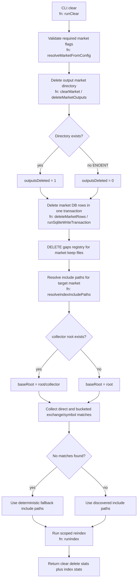

# Clear task

## Purpose
Delete one market's output + DB state, then reindex only that market subtree.

## Command
```bash
npm start -- clear --collector <RAM|PI> --exchange <EXCHANGE> --symbol <SYMBOL>
```

Required flags:
- `--collector <RAM|PI>`
- `--exchange <EXCHANGE>`
- `--symbol <SYMBOL>`

## Behavior
- delete `{outDir}/{collector}/{exchange}/{symbol}` if present
- delete matching market rows from `gaps` and `registry`
- keep `files` rows intact (clear does not currently delete indexed file inventory)
- resolve include paths for only the target market under `root`
- run `index` with those scoped include paths

## Include-path resolution
- If `{root}/{collector}` exists, clear treats that as the collector base.
- It includes direct `{baseRoot}/{exchange}/{symbol}` when present.
- It also scans buckets under `baseRoot` and includes `{baseRoot}/{bucket}/{exchange}/{symbol}` matches.
- If no physical matches are found, deterministic fallback include paths are used.

## Mermaid flow

