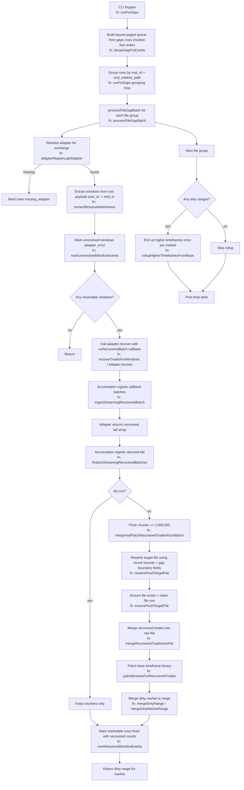

# Fixgaps task

## Purpose
Recover missing trades from persisted gap rows, rewrite affected raw files deterministically, and patch binaries.

## Command
```bash
npm start -- fixgaps [flags]
```

Key flags:
- `--collector <RAM|PI>`
- `--exchange <EXCHANGE>`
- `--symbol <SYMBOL>`
- `--id <event_id>`
- `--limit <n>`
- `--retry-status <csv>`
- `--dry-run`

Queue source:
- `gaps` rows
- `--id` takes precedence over retry-status queue selection
- Default traversal is market-first: `collector/exchange/symbol`, then deterministic file order (`root_id/end_relative_path/id`).
- Queue reads are keyset-paged (`1024` rows/page) so fixgaps can keep writing gap statuses without holding a long-lived read cursor.

## Recovery batching
- Fixgaps skips recovery for rows where `gap_ms > 60d`; those rows are marked `skipped_large_gap` with `recovered=0` and no adapter call.
- Recovered trades are merged in deterministic flush batches of `1,000,000` trades.
- Each flush batch target path is resolved from persisted gap boundary fields and chunk timestamps:
  - default: write to `end_relative_path`
  - if `firstTs <= start_ts + 1 day`: write to `start_relative_path`
  - if `firstTs >= start_ts + 1 day` and `lastTs <= end_ts - 1 day`: write to an intermediate file inferred from boundary filename format (`YYYY-MM-DD-HH(.gz)` => 4h slots, otherwise daily).
- If a target file path does not exist, fixgaps creates it and indexes it before merge/patch.
- Fixgaps always provides an adapter batch callback; adapters can emit recovered batches through it, and any returned tail array is ingested through the same accumulator path.

## Pipeline
For each grouped `(root_id, end_relative_path)`:
1. Resolve one recovery window per gap row from persisted payload timestamps (`start_ts` to `end_ts`), and skip windows with `gap_ms > 60d`.
2. Call the exchange adapter with `onRecoveredBatch` callback support.
3. Ingest callback batches and returned adapter tail through the same accumulator.
4. Flush deterministic chunks (`1,000,000` max per chunk), resolve target file with the start/end boundary rules above, then deterministically rewrite by timestamp sort-normalization:
   - existing + recovered trades merged
   - recovered row multiplicity is preserved (no trade-level dedupe by key)
   - non-trade lines preserved
5. Patch base timeframe binary over the recovered range.
6. Roll up affected higher timeframes from patched base.
7. Update gap lifecycle fields.

### Mermaid flow


## Gap status lifecycle
- `fixed`: adapter/rewrite/patch pipeline succeeded (including 0 recovered)
- `skipped_large_gap`: row was intentionally skipped by the `>60d` long-gap guard
- `missing_adapter`: adapter unavailable
- `adapter_error`: adapter or patch pipeline failure

## Dry-run behavior
With `--dry-run`:
- adapters are called
- recovery counts are reported
- no file rewrites
- no binary patches
- no `gaps` status updates

## Adapter coverage
Current adapters include:
- BINANCE / BINANCE_FUTURES
- BYBIT
- KRAKEN (archive + API tail fallback)
- BITFINEX
- BITMEX
- OKEX / OKX
- KUCOIN
- HUOBI / HTX
- COINBASE

## Runtime notes
- Requires `sort` and `unzip` binaries in `PATH`.
- Progress renderer env vars:
  - `AGGR_FIXGAPS_PROGRESS`
  - `AGGR_FIXGAPS_DEBUG`
  - `AGGR_FIXGAPS_DEBUG_ADAPTERS`
  - `AGGR_FIXGAPS_DEBUG_HTTP`
