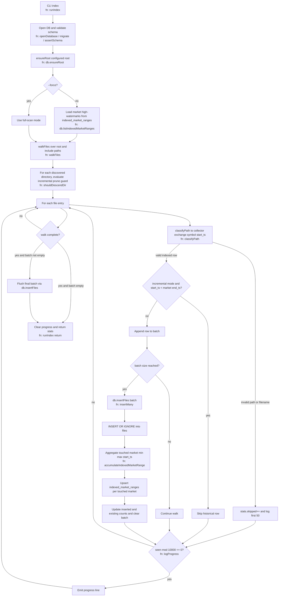

# Index task

## Purpose
Build and maintain the SQLite inventory used by `process`, `fixgaps`, and timeline APIs.

## Command
```bash
npm start -- index [flags]
```

Key flags:
- `--root <path>` input root
- `--db <path>` SQLite path
- `--batch <n>` insert batch size
- `--include <path>` repeatable subtree filter
- `--force` disable incremental shortcut; full-scan reconcile all files
- `--collector <RAM|PI>` optional scope
- `--exchange <EXCHANGE>` optional scope
- `--symbol <SYMBOL>` optional scope

Related task:
- Scoped market reset and reindex is documented in [clear.md](clear.md).

## Input contract
Path layout:
```text
{collector}/{bucket}/{exchange}/{symbol}/{YYYY-MM-DD[-HH][.gz]}
```

- Exchange/symbol are derived from path.
- Filename timestamp is parsed as UTC.
- Plain text and gzip are accepted.

## Normalization rules
- Path-based deterministic normalization.
- Poloniex: `USDT_BTC -> BTC_USDT` (quote-second form).
- Bitget rename handling:
  - spot markets are `-SPOT`
  - `_UMCBL/_DMCBL/_CMCBL` suffixes dropped for derivatives

## Stored inventory model
`index` maintains:
- `roots`: indexed root paths
- `files`: one row per file (`collector/exchange/symbol/start_ts/...`)
- `indexed_market_ranges`: cached per-market min/max `start_ts`

## Behavior
- Walk matching files once.
- In incremental mode, skip descending unchanged market symbol directories when directory `mtime <= indexed_market_ranges.updated_at`.
- In incremental mode, symbol directories with no matching market key in `indexed_market_ranges` are still scanned so newly collected markets are discovered.
- Default mode is incremental: for markets already present in `indexed_market_ranges`, skip rows with `start_ts < current market end_ts`.
- Keep `start_ts == current market end_ts` eligible to preserve same-timestamp additions.
- Insert eligible rows with append-only `INSERT OR IGNORE` semantics.
- Update `indexed_market_ranges` incrementally during inserted-file batches.
- No processed flags are written.
- With `--force`, disable the incremental shortcut and re-evaluate all files.

### Mermaid flow (`index`)


## Determinism and schema policy
- Same input tree + config => same indexed set.
- Duplicate paths are ignored by primary key.
- Startup validates expected schema shape and required constraints.
- No in-place DB migrations are performed.
- Incompatible schema => fail fast with rebuild instruction.

## Troubleshooting
- `Incompatible schema ...`: delete DB and rerun `index`.
- `indexed_market_ranges is empty while files has data`: delete DB and rerun `index`.
- Historical backfills (new files older than current market `end_ts`) require `npm start -- index --force` to reconcile.
- Brand-new or unmatched market directories are discovered by default incremental scans.
