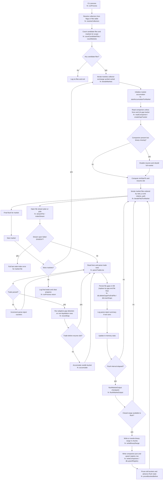

# Process task

## Purpose
Stream indexed trade files and produce gap-aware candle binaries + companions.

## Command
```bash
npm start -- process [flags]
```

Key flags:
- `--collector <RAM|PI>`
- `--exchange <EXCHANGE>`
- `--symbol <SYMBOL>`
- `--timeframe <tf>`
- `--flush-interval <seconds>` checkpoint cadence
- `--force` full rebuild (disable resume guards)

## Input assumptions
- Files are discovered from `files` table, ordered by `start_ts, relative_path`.
- Per-trade line format:
  ```text
  {ts_ms} {price} {size} {side(1=buy)} {liquidation?}
  ```

## Per-trade correction rules
Applied during streaming before accumulation:
- Corrupted rows: rejected by parser and summarized in warning logs.

## Output files
For each `(collector, exchange, symbol, timeframe)`:
- `{outDir}/{collector}/{exchange}/{symbol}/{timeframe}.bin`
- `{outDir}/{collector}/{exchange}/{symbol}/{timeframe}.json`

Registry is upserted from flushed companion range.

## Binary format
Per candle (`56` bytes):
```text
OHLC:          4 x int32  = 16 B
vBuy/vSell:    2 x int64  = 16 B   (quote volume)
cBuy/cSell:    2 x uint32 =  8 B   (trade counts)
lBuy/lSell:    2 x int64  = 16 B   (liquidation quote volume)
----------------------------------------------
Total                      56 B
```

## Companion contract
Companion JSON includes at least:
- market identity (`exchange`, `symbol`)
- timeframe info (`timeframe`, `timeframeMs`)
- range (`startTs`, `endTs`)
- scales (`priceScale`, `volumeScale`)
- record count (`records`)
- resume anchor (`lastInputStartTs`)
- adaptive gap tracker snapshot fields

## Resume semantics
Without `--force`, when companion exists:
- Skip files with `start_ts < lastInputStartTs`.
- Skip trades `< endTs - timeframeMs` (resume slot).
- First resume flush truncates binary to resume slot, rewrites that slot, then appends.
- Checkpoint flushes update companion + registry.
- Companion exists but binary missing => full rebuild for that market.

With `--force`:
- Ignore resume guards and rebuild from scratch.

## Gap persistence and detection
Process writes gap rows into `gaps` (one row per detected gap):
- `gap_ms`, `gap_miss`, `gap_score`
- `start_ts`, `end_ts`
- `start_relative_path`, `end_relative_path`
- parse rejects are not persisted; they are summarized in logs (`[parse-skip] ...`)

Gap detection is adaptive per market:
- liquidation rows excluded from gap tracking
- same-timestamp handling avoids false gap inflation
- thresholds use adaptive average gap and timeframe window

## Performance model
- One market accumulator at a time.
- Old buckets pruned after flushes.
- Chunked binary writes.
- No per-trade DB writes.
- Periodic checkpoint flushes keep runs resumable.

## Mermaid flow


## Failure handling
- SQLite write contention (`SQLITE_BUSY`/`SQLITE_LOCKED`) retries with bounded backoff.
- If an indexed `files` row points to a missing input path on disk, process fails fast with an explicit stale-index error for that market/file.
- On that missing-input failure, no further files are processed and existing gap rows for the failing file are left unchanged.
- If binary/companion persisted but registry missed update (interruption), run `registry` for affected scope.
