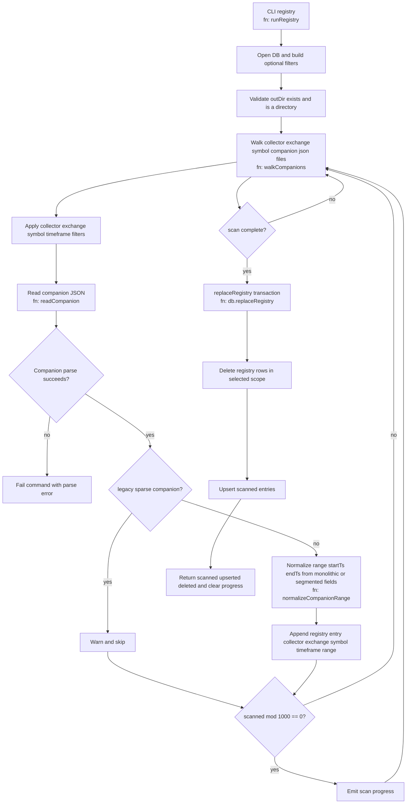

# Registry task

## Purpose
Rebuild registry rows from output companion files.

Registry is derived state; use this command to reconcile DB with existing binaries/companions.

## Command
```bash
npm start -- registry [flags]
```

Key flags:
- `--collector <RAM|PI>`
- `--exchange <EXCHANGE>`
- `--symbol <SYMBOL>`
- `--timeframe <tf>`

## Behavior
- Scan companions under `{outDir}/{collector}/{exchange}/{symbol}`.
- Build registry entries from companion time ranges.
- Replace matching DB scope atomically.

## Mermaid flow


## When to run
- After process interruption where companion/binary likely persisted but DB upsert failed.
- After manual output restoration/copy.
- As periodic DB consistency repair.
